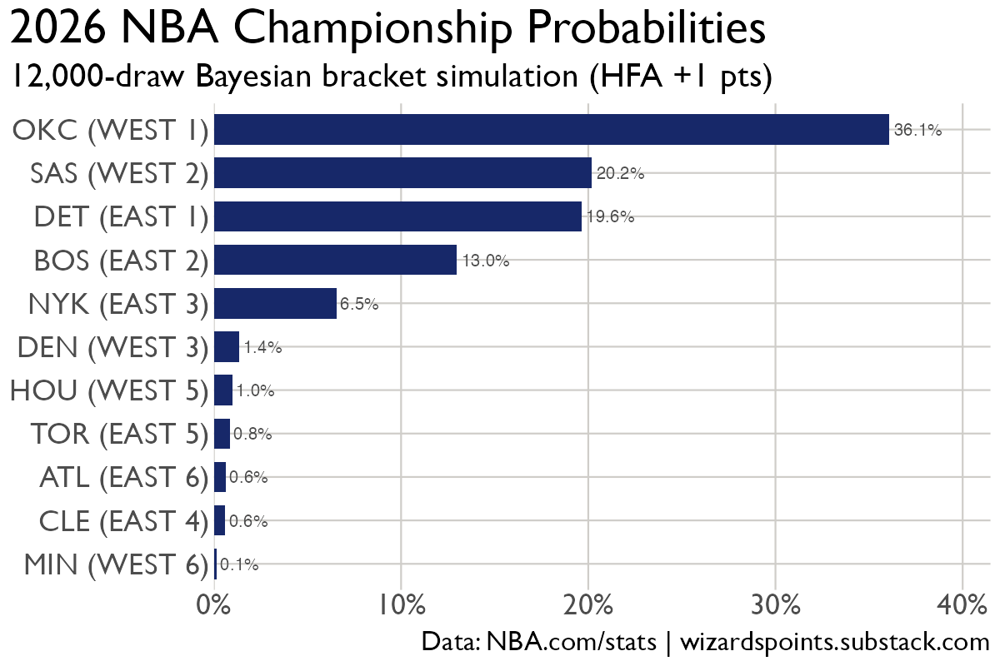

# 2026 NBA Playoff Bracket Simulator

Monte Carlo simulation of the 2026 NBA playoff bracket using a Bayesian hierarchical model fit to every regular-season game. Run it yourself — no additional data pipeline required.

```bash
Rscript bracket_sim.R
```

Outputs go to `output/` in about 2 minutes.

---

## Results (final run: 2026-04-18)

**Modal bracket: OKC beats DET in the NBA Finals.**



| Team | R1 Win% | Semis% | Conf Finals% | Champion% |
|---|---|---|---|---|
| OKC (W1) | 96% | 86% | 57% | **36%** |
| SAS (W2) | 97% | 78% | 35% | **20%** |
| DET (E1) | 96% | 76% | 44% | **20%** |
| BOS (E2) | 94% | 59% | 31% | 13% |
| NYK (E3) | 73% | 34% | 17% | 7% |
| HOU (W5) | 85% | 14% | 3% | 1% |

Most likely Finals: OKC vs DET (24% of all simulations); OKC wins those matchups 61% of the time.

**Round 1 matchup win probabilities:**
- OKC 96% / PHX 4% — HOU 85% / LAL 15% — DEN 72% / MIN 28% — SAS 97% / POR 3%
- DET 96% / ORL 5% — CLE 49% / TOR 51% — NYK 73% / ATL 27% — BOS 94% / PHI 6%

---

## How It Works

### Stage 1 — Team strength from the full regular season

A **Bayesian hierarchical model** is fit to every 2025-26 NBA game using Stan (No-U-Turn Sampler). The outcome variable is the point differential (home minus away), modeled as:

```
score_diff ~ Student_t(ν, μ_spread, σ_points)
```

The Student-t distribution (vs. Normal) accommodates blowouts without distorting the bulk of games. The expected spread is:

```
μ_spread = μ_offense
         + home_advantage
         + θ_offense[home] − θ_defense[away]
         − (θ_offense[away] − θ_defense[home])
         + β_rest    × rest_std
         + β_form    × form_std
         + β_blowout × blowout_std
```

Team effects (`θ_offense`, `θ_defense`) are partial-pooled random effects — teams with few games are pulled toward the league mean; teams with 82 games barely move. The model produces **12,000 joint posterior draws** over all 60+ parameters, encoding full uncertainty about team quality.

Out-of-sample validation on 130+ withheld games: **73.8% directional accuracy** (correct winner picked), vs. ~60% from Vegas lines alone.

### Stage 2 — Bracket simulation

For each of 12,000 posterior draws, the full bracket is simulated game-by-game:

- **Play-in**: PHX (beat GSW) and ORL (beat CHA) are fixed seeds; if seeds were unknown, the play-in would be simulated
- **Series**: Best-of-7, first to 4 wins; home court follows the NBA schedule (games 1, 2, 5, 7 at top seed; 3, 4, 6 at bottom seed)
- **Re-seeding**: After each round, survivors are re-ranked by original seed and re-paired (1v4, 2v3) — matching the NBA's actual format
- **Aggregation**: Championship probability = wins / 12,000 draws

---

## Model Decisions

### Playoff HFA boost (+1.0 pts)

The Stan model's posterior home-court advantage is ~1.58 pts, estimated from the full regular season. Historical playoff HFA is ~2.5 pts. A fixed `PLAYOFF_HFA_BOOST = 1.0` is added to every home team to close this gap. This is a manual calibration, not fit from data — the decision was to correct for the known systematic gap rather than let the model under-estimate home advantage in the postseason.

### Pure model spreads (no Vegas blend)

The daily prediction pipeline blends model spreads with Vegas lines for sharper single-game picks. The bracket sim deliberately does **not** do this. Vegas lines aren't available for Round 2+ games at simulation time, and blending partial information creates inconsistency across rounds. The bracket uses pure posterior spreads throughout.

### James-Stein shrinkage for playoff form

Once playoff games are available, recent form blends regular-season and playoff performance:

```
form_5g = (playoff_pm_sum + K × reg_season_form) / (n_playoff_games + K)
```

with `K = 5`. This means:
- 0 playoff games → 100% regular-season form
- 5 games → 50/50 blend
- 15 games → 75% playoff, 25% regular season

A single Game 1 blowout can't dominate the feature.

### Tanking score zeroed for all playoff teams

The main model includes a tanking penalty (teams playing for lottery position). All playoff teams have this zeroed — no playoff team has an incentive to lose.

### Injury adjustments

Injuries are applied as **additive point offsets** to every game that team plays. This is intentionally simple: the model doesn't know individual player values, so a manual estimate of expected point impact is cleaner than trying to infer it from the posterior. Active adjustments for this run:

```r
injury_adj <- c(
  "LAL" = -6.0,   # Doncic + Reaves both out
  "TOR" = -1.5    # Quickley hamstring + 5-22 record vs elite teams
)
```

---

## Sensitivity Tests

These show how key assumptions move OKC's and DET's championship probabilities.

### HFA boost

| `PLAYOFF_HFA_BOOST` | OKC% | DET% | Notes |
|---|---|---|---|
| 0.0 (no boost) | ~33% | ~18% | Under-corrects; model HFA is below historical |
| **1.0 (default)** | **36%** | **20%** | Calibrated to historical playoff HFA ~2.5 pts |
| 2.0 (full gap) | ~38% | ~21% | Slightly over-corrects |

Higher HFA advantages higher seeds throughout; OKC and DET as #1 seeds benefit the most.

### LAL injury adjustment

| LAL adj | HOU% (W5) | Notes |
|---|---|---|
| 0.0 (no injury) | ~8% | Full-strength LAL pushes HOU out |
| **−6.0 (default)** | **~1%** | Doncic + Reaves out; LAL is effectively eliminated |
| −3.0 (partial) | ~4% | One star out |

The LAL adjustment is the single largest swing in the simulation. With both Doncic and Reaves out, LAL's expected scoring drops enough that even home court doesn't help.

### N simulation draws

| N_DRAWS | OKC% | Runtime |
|---|---|---|
| 1,000 | ±2–3% noise | ~10 sec |
| 5,000 | ±1% noise | ~30 sec |
| **12,000 (default)** | **<0.5% noise** | **~2 min** |

12,000 is the sweet spot — matches the posterior draw count from the Stan fit, so no re-sampling is needed in expectation.

### CLE vs TOR (model near coin-flip)

The model gives TOR a 51% win probability vs CLE — a near coin-flip. Expert consensus strongly favors CLE. This series is the bracket's highest-uncertainty pick; the simulation correctly represents it as essentially even rather than forcing a false confidence.

---

## Configuration

Edit the top of `bracket_sim.R` to update assumptions:

| Variable | Default | Purpose |
|---|---|---|
| `WEST_8_SEED` | `"PHX"` | West play-in winner (or `NA` to simulate) |
| `EAST_8_SEED` | `"ORL"` | East play-in winner (or `NA` to simulate) |
| `PLAYOFF_HFA_BOOST` | `1.0` | Extra pts added to home_advantage |
| `injury_adj` | `c(LAL=-6.0, TOR=-1.5)` | Per-team point offsets |
| `N_DRAWS` | `12000` | Posterior draw count |
| `rest_days_override` | `c(PHX=2L, ORL=2L)` | Manual rest days for play-in teams |

---

## Files

```
bracket_sim_2026/
├── bracket_sim.R              ← main simulation script
├── export_model_data.R        ← one-time export from nba_point_spread (already done)
├── data/                      ← self-contained model inputs
│   ├── draws_slim.rds         ← 12,000 posterior draws (66 parameters)
│   ├── scaling_params.rds     ← standardization params for context features
│   ├── team_index.rds         ← team ID → Stan array index mapping
│   ├── game_logs_slim.rds     ← regular-season game logs (rest/form)
│   └── season_config.rds      ← PLAYOFF_START, shrinkage K
└── output/
    ├── bracket_probs_*.csv    ← round-by-round win probabilities
    ├── modal_bracket_*.csv    ← single contest pick per slot
    ├── bracket_champion_probs.png
    └── bracket_heatmap.png
```

## Dependencies

```r
install.packages(c("tidyverse", "janitor", "ragg", "scales"))
# optional: usaidplot (falls back to theme_minimal if not installed)
```
